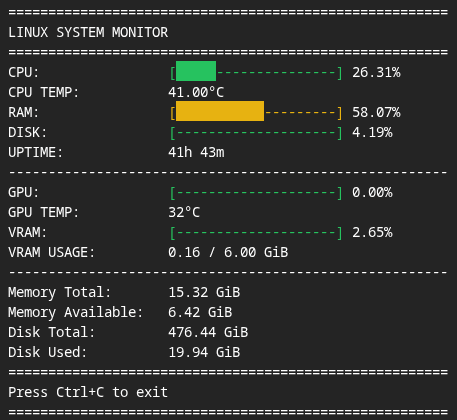

<div align="center">

# Linux System Monitor

### Real-time hardware monitoring, straight from your terminal.

A lightweight Linux system monitor built with Python. Track CPU and GPU activity, temperatures, memory, disk usage, and system uptime through a clean, continuously updating terminal dashboard.

<br>


<br>



<br>

**[Features](#features) · [Getting Started](#getting-started) · [How It Works](#how-it-works) · [Testing](#testing)**

</div>

---

## Overview

Linux System Monitor is a terminal-based project focused on collecting and presenting real hardware metrics without a graphical interface or third-party Python dependencies.

The monitor reads information directly from Linux system interfaces and uses NVIDIA's command-line utility when a compatible GPU is available.

It was developed as a hands-on Python and Linux learning project, with an emphasis on understanding where system metrics come from, how they are calculated, and how to turn them into a usable application.

## Preview

```text
=======================================================
LINUX SYSTEM MONITOR
=======================================================
CPU:                [██------------------] 10.00%
CPU TEMP:           40.00°C
RAM:                [███████████---------] 57.58%
DISK:               [█-------------------] 4.18%
UPTIME:             38h 45m
-------------------------------------------------------
GPU:                [--------------------] 0.00%
GPU TEMP:           32°C
VRAM:               [█-------------------] 2.65%
VRAM USAGE:         0.16 / 6.00 GiB
-------------------------------------------------------
Memory Total:       15.32 GiB
Memory Available:    6.50 GiB
Disk Total:         476.44 GiB
Disk Used:           19.92 GiB
=======================================================
Press Ctrl+C to exit
=======================================================
```

*Illustrative output. Actual values are collected from your system and refreshed continuously. Progress bars use green, yellow, and red according to utilization.*

## Features

| Metric | What it shows | Data source |
|---|---|---|
| CPU usage | Processor utilization over a measurement interval | `/proc/stat` |
| CPU temperature | CPU package temperature, when available | Linux `hwmon` / `coretemp` |
| Memory | RAM utilization, total and available memory | `/proc/meminfo` |
| Disk | Usage of the filesystem containing `/` | Python `shutil` |
| Uptime | Time since the system started | `/proc/uptime` |
| GPU usage | NVIDIA GPU utilization | `nvidia-smi` |
| GPU temperature | NVIDIA GPU temperature | `nvidia-smi` |
| VRAM | Video memory utilization, used and total | `nvidia-smi` |

### Designed for the terminal

- Live dashboard with automatic refresh.
- Colored progress bars using ANSI RGB escape sequences.
- Consistent labels and readable numeric formatting.
- Graceful shutdown with `Ctrl+C`.
- `N/A` display when supported temperature or GPU metrics are unavailable.
- No third-party Python packages required.

### Color thresholds

Progress-bar colors provide a quick visual reference for **utilization percentages**:

| Utilization | Color |
|---|---|
| Below 50% | 🟢 Green |
| 50% to below 85% | 🟡 Yellow |
| 85% and above | 🔴 Red |

These thresholds are visual indicators, not hardware-health assessments. Temperature readings are displayed in °C and are not evaluated using percentage thresholds.

---

## Getting Started

### Requirements

- Linux.
- Python 3.10 or newer.
- A terminal with ANSI color support.

**Optional:** A supported NVIDIA GPU with a working driver and the `nvidia-smi` utility for GPU and VRAM metrics.

CPU temperature monitoring currently uses the Linux `coretemp` interface and looks for the `Package id 0` sensor. Availability depends on the processor, driver, and system configuration.

### 1. Clone the repository

```bash
git clone https://github.com/AS-Azevedo/linux-system-monitor.git
cd linux-system-monitor
```

### 2. Run the monitor

```bash
python monitor.py
```

On systems where Python 3 is invoked as `python3`, use:

```bash
python3 monitor.py
```

The dashboard will start updating automatically.

Press **Ctrl+C** to stop monitoring.

### 3. Check NVIDIA support (optional)

If you have an NVIDIA GPU, verify that the driver can expose its metrics:

```bash
nvidia-smi
```

If the utility is unavailable or the query fails, the monitor continues running and displays `N/A` for NVIDIA metrics.

---

## How It Works

The application separates **data collection**, **calculations**, and **terminal presentation**.

```text
                    LINUX SYSTEM MONITOR
                             |
          +------------------+------------------+
          |                  |                  |
       /proc               /sys             nvidia-smi
          |                  |                  |
    CPU / RAM /          CPU package        GPU / VRAM /
      Uptime             temperature        GPU temperature
          |                  |                  |
          +------------------+------------------+
                             |
                     Python functions
                             |
                 Formatting and progress bars
                             |
                     Terminal dashboard
                             |
                    Refresh continuously
```

### CPU utilization

CPU usage is calculated from **two readings** of the cumulative counters in `/proc/stat`.

The monitor compares the changes in total and idle time:

```text
CPU usage = (1 - delta_idle / delta_total) × 100
```

This provides utilization over the measurement interval rather than treating a cumulative counter as an instantaneous percentage.

### CPU temperature

The application searches `/sys/class/hwmon/` for a device named `coretemp`, then locates the sensor labeled `Package id 0`.

The sensor's raw value is converted from millidegrees Celsius:

```text
37000 / 1000 = 37.0°C
```

The code identifies the device and sensor by their names rather than relying on a fixed `hwmon` directory number.

### NVIDIA GPU metrics

When available, the monitor uses `nvidia-smi` with selected CSV fields:

```bash
nvidia-smi --query-gpu=utilization.gpu,temperature.gpu,memory.used,memory.total --format=csv,noheader,nounits --id=0
```

Python runs the command through `subprocess`, captures the output, and converts the values into metrics for the dashboard.

The current implementation targets NVIDIA GPU index `0`.

---

## Testing

The project includes **31 automated tests** built with Python's standard-library `unittest` module.

Run the complete test suite:

```bash
python -m unittest discover -v
```

Or run the test file directly:

```bash
python -m unittest test_monitor.py -v
```

The tests cover:

- CPU utilization calculations and edge cases.
- Progress-bar lengths, formatting, colors, and boundaries.
- Memory and disk calculations.
- Uptime conversion.
- NVIDIA GPU output parsing and failure scenarios.
- CPU package temperature discovery and invalid readings.

Hardware-dependent tests use `unittest.mock` to simulate system responses. This makes it possible to test scenarios such as an unavailable NVIDIA command or an invalid temperature reading without changing the computer's actual hardware configuration.

## Project Structure

```text
linux-system-monitor/
├── monitor.py          # Data collection and terminal dashboard
├── test_monitor.py     # Automated tests
├── .gitignore          # Local files and Python cache exclusions
└── README.md           # Project documentation
```

---

## Current Scope

This project currently focuses on a **single-machine Linux terminal dashboard**.

NVIDIA metrics require `nvidia-smi`, and CPU package temperature support depends on the availability of the expected `coretemp` sensor. Other CPU sensor drivers and GPU vendors are not yet covered by the same collection logic.

The dashboard intentionally remains lightweight: no web server, database, graphical toolkit, or third-party Python monitoring package is required.

## Built While Learning

This project is part of my programming learning journey. Its development has included practical work with:

**Python** · **Linux** · **procfs** · **sysfs** · **subprocess** · **pathlib** · **ANSI terminal formatting** · **unittest** · **mocking** · **Git**

The goal is not only to display system metrics, but to understand the underlying mechanisms and build the application incrementally.

---

<div align="center">

**Built with Python. Powered by Linux system interfaces.**

[Back to top ↑](#linux-system-monitor)

</div>